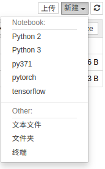

# 小技巧
## 安装conda后取消命令行前出现的base，取消每次启动自动激活conda的基础环境, 使用ubuntu 自带的Python环境
方法一：

退出base环境回到系统自带的环境

```
conda deactivate 
```


方法二

1，通过将auto_activate_base参数设置为false实现：
```
conda config --set auto_activate_base false
```
2，那要进入的话通过conda activate base

3，如果反悔了还是希望base一直留着的话通过
```
conda config --set auto_activate_base true
```
来恢复

## conda创建环境和kernel
### 创建环境
* 创建环境不带kernel
`conda create -n [env_name]`
* 如果经常需要用jupyter notebook，那么最好在创建虚拟环境的时候便安装好ipykernel   
`conda create -n [env_name] python=[version] ipykernel`
### 后期给环境配置kernel
1. 如果没有安装，先安装kernel  
`ipykernel：conda install ipykernel`  
在虚拟环境下创建kernel文件：`conda install -n [env_name] ipykernel`（是否有用暂时不详）  
2. 激活环境  
`source activate [env_name]`或者`conda activate [env_name]`  
3. 写入  
`python -m ipykernel install --name [kernel_name]`（亲测）  
或者`python -m ipykernel install --user --name [env_name] --display-name [kernel_name]`（未测试，不知与上条命令的区别）  
这样在目录'/usr/local/share/jupyter/kernels/[env_name]/'下会生成一个kernel.json文件，内容如下：  
``` json
{
 "argv": [
  "/home/xupeng/anaconda3/envs/tensorflow/bin/python",
  "-m",
  "ipykernel_launcher",
  "-f",
  "{connection_file}"
 ],
 "display_name": "tensorflow",
 "language": "python"
}
```
在jupyter notebook 新建文件的时候可以看到该kernel  



  
  
